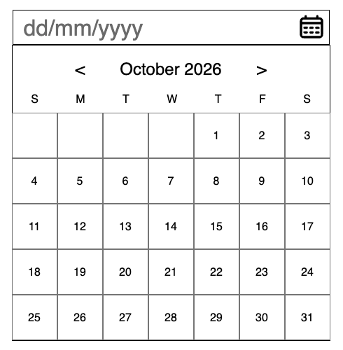

# Datepicker UI

A static datepicker UI built with only **HTML** and **CSS**. It is not functional yet, it is a visual foundation to be enhanced with JavaScript in a future project.

**Project URL:** https://roadmap.sh/projects/datepicker-ui

**Repository:** https://github.com/KunalGuhagarkar/Datepicker-UI

## Preview



## Overview

This project is a practice exercise in CSS positioning, layout, and styling. It recreates a simple datepicker consisting of:

- A text input with a `dd/mm/yyyy` placeholder and a calendar icon button
- A calendar panel showing the month and year (October 2026) with previous/next arrows
- A row of weekday headings (S M T W T F S)
- A 7-column grid of dates, with leading empty cells so the 1st lands on a Thursday

## Tech Stack

- HTML5
- CSS3 (Flexbox)

## Project Structure

```
datepicker-ui/
├── index.html
├── style.css
├── images/
│   ├── calendar.svg
│   └── preview.png
└── README.md
```

## Getting Started

1. Clone the repository:
   ```bash
   git clone https://github.com/KunalGuhagarkar/Datepicker-UI.git
   ```
2. Navigate into the folder:
   ```bash
   cd datepicker-ui
   ```
3. Open `index.html` in your browser. No build step or dependencies are needed.

## What I Practiced

- Centering and stacking elements with Flexbox
- Building a calendar grid from rows of fixed-size cells
- Aligning an input and button so they look like one control
- Using `box-sizing: border-box` and a CSS reset for predictable sizing
- Spacing elements with `gap` and `margin`

## Author

Kunal Guhagarkar
